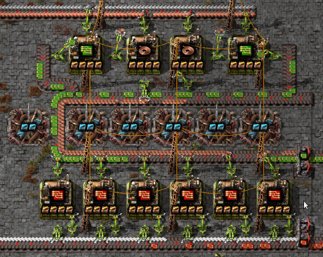

.. default-role:: py:obj
.. highlight:: none

.. py:currentmodule:: factoriocalc

Overview
********

This guide is meant to give you an overview of all the important parts of
FactoriCalc.  It does not spell out all the details for every function
introduced and assumes the examples provided are sufficient.  For complete
documentation see the API docs.  A decent knowledge of how to play Factorio is
assumed.

Basics
======

All symbols you need are exported into the main `factoriocalc` namespace so it
is rare you will need to import from a sub-module.  FactorioCalc is meant to
be used interactively via a REPL, with details of your overall factory
collected in a simple script.  For this reason it is acceptable to use ``from
factoricalc import *`` and the rest of the documentation will assume you have
done so.

For lack of a better term, *factory*, will be used thoughout this document to
refer to any group of machines that work together to produce one or more
products.  The term *overall factory* will be used to refer to all the
factories on the map.

Factoricalc uses exact fractions internally.  For speed a custom fraction
class is used.  This class does not allow converstion from floats, as 0.12
as a float is not 12/100 but really 1080863910568919/9007199254740992, which
is almost certainly not what was intended.  There are various heuristics
that can be used to give a better conversion, but for now it is easier to
disallow them.  In almost any place that expects a number a string can be
used instead, in the rare case a number is needed the `frac` function can be
used to create a `Frac`.  For example: ``frac('0.12')``, ``frac('1/3')``,
``frac(1,3)``.

Each machine is a class in the runtime generated `mch` package.  The name of
the machine is the same as the internal name but converted to TitleCase.  The
internal name is often the same as English name, but not always.  To find a
machine based on the translated name you can use the `mch._find()` function.
To get the translated name of a machine use the `~Machine.descr` property.

To produce something from a machine you need to instantiate it.  The first
argument of the constructor is the recipe.  For example, to create an
"assembling-machine-3" that produces electronic circuits you could use
``mch.AssemblingMachine3(rcp.electronic_circuit)``.  Additional keyword
arguments can be provided to specify the fuel used, beacons, and modules when
applicable.

Recipes are in the runtime generated `rcp` package and are the same as the
internal names but with ``-`` (dashes) converted to ``_`` (underscores).
Items are in `itm`.  Like the `mch` package, both the `rcp` and `itm` package
have have a `_find()` function to find an item based on the translated name.

Within FactorioCalc the items a machine produces or consumes is cosidered a
*flow*.  The rate of the flow is positive for items produced and negative
for items consumed.

To get the flow of items for a machine use the `flows` method, for example::

  >>> mch.AssemblingMachine3(rcp.electronic_circuit).flows()
  <<iron_plate -2.5/s> <copper_cable -7.5/s> <electronic_circuit 2.5/s> <electricity -0.3875 MW>>

Electricity used is also tracked as a flow.  To get a nicer formatted version
use the `~Flows.print()` method:

  >>> mch.AssemblingMachine3(rcp.electronic_circuit).flows().print()
  iron_plate -2.5/s
  copper_cable -7.5/s
  electronic_circuit 2.5/s
  electricity -0.3875 MW

Multiple machines can be grouped together using the `+` operator which will
create a `Group`.  For example::

  >>> ec = mch.AssemblingMachine3(rcp.electronic_circuit) + mch.AssemblingMachine3(rcp.copper_cable)

We can then get the flows of the group by using ``ec.flows().print()``::

  electronic_circuit 2.5/s
  copper_cable! -2.5/s (5/s - 7.5/s)
  iron_plate -2.5/s
  copper_plate -2.5/s
  electricity -0.775 MW

This is showing us the maxium rates for the group, but there is a problem:
we are creating copper cables at a rate of 5/s but consuming them at -7.5/s.
The ``!`` after copper cables indicates a lack of an ingredient.  We can fix
this by using the correct ratios or by slowing down the machine that creates
electronic circuits by adjusting it's *throttle*.

To fix the ratios we can use the `*` operator to create multiple identical
machines.  For example, to combine the two recipes above using the correct
ratio::

  >>> ec2 = 2*mch.AssemblingMachine3(rcp.electronic_circuit) + 3*mch.AssemblingMachine3(rcp.copper_cable)

If we ask for the flows of the new `Group` we now get::

  electronic_circuit 5/s
  copper_cable 0/s (15/s - 15/s)
  iron_plate -5/s
  copper_plate -7.5/s
  electricity -1.9375 MW

To instead slow down the machines we need to adjust the *throttle*.  We can do
this manually, but it's best to let the solver determine it for us.  To do so,
we first need to wrap the group in a *box*::

  >>> b = Box(ec)

and then solve it::

  >>> b.solve()
  <SolveRes.UNIQUE: 2>

The result of solve tells us a single unique solution was found.  Now if we
call ``b.flows().print()`` we get::

  electronic_circuit 1.66667/s
  iron_plate -1.66667/s
  copper_plate -2.5/s
  electricity -0.65 MW

Copper-cable is not in the list beacuase it's net flow is now zero.  Boxes,
unlike groups, do not include internal flows unless the net flow is non-zero.
An *internal flow* is simply a flow in which there are both producers and
consumers within the same box.

As creating a box and then solving it is a very common operation the `box`
shortcut function is provided to do just that, it usage is the same as the
`Box` constructor.  For example, we could of instead used::

  >>> b = box(ec)

To determine what the solver did we can use the `summary` method.  Calling
it gives us::

  >>> b.summary()
  b-electronic-circuit:
         1x electronic_circuit: AssemblingMachine3  @0.666667
         1x copper_cable: AssemblingMachine3
    Outputs: electronic_circuit 1.66667/s
    Inputs: iron_plate -1.66667/s, copper_plate -2.5/s

The ``@0.66667`` indiactes that the assembling machine for the
electronic-circuit is throttled and only running at 2/3 it's capacity.

Modules And Beacons
===================

Having to spell out the type of machine you want each time will get tedious
very fast so FactorioCalc provides a shortcut.  However, before you can use
the shortcut, you need to specify what type of assembling machine you want to
use.  This is done by setting `config.machinePrefs`, which is a python
`ContextVar <https://docs.python.org/3/library/contextvars.html>`_.  For now
we will set it to `~presets.MP_LATE_GAME` in the `presets` module which will use
the most advanced machines possible for a recipe::

  >>> from presets import *
  >>> config.machinePrefs.set(MP_LATE_GAME)

With that we can simply call a recipe to produce a machine that will use the
given recipe.  Now to create electronic circuits from copper and iron plates
we can instead use::

  >>> ec2 = 2*rcp.electronic_circuit() + 3*rcp.copper_cable()

Of cource in the late game we are going to want to use productivity-3
modules with beacons stuffed with speed-3 modules.  You can pass modules and
beacons to the call above or include them in the `machinePrefs`.

To include them in the call simply use the *modules* and *beacons* parameter.
For example, to make electronic circuits with 4 productivity-3 modules and 8
beacons with speed-3 modules use::

  rcp.electronic_circuit(modules=4*itm.productivity_module_3,
                         beacons=8*Beacon(modules=2*itm.speed_module_3))

When specifying modules you can either provide a list of them (as above) or a
single module to fill the machine to with as many of that module as possible.
When you need a beacon with two speed-3 modules you can use the
`~presets.SPEED_BEACON` shortcut in `presets`.  For example, the above call
can become::

   rcp.electronic_circuit(modules=itm.productivity_module_3,
                          beacons=8*SPEED_BEACON)

Specifying the modules and becons configuration for each machine can be
tedious so as an alternative FactorioCalc lets you set prefered machine
configurations as part of `config.machinePrefs`.  If all we cared about is
assmebling machines we could just use::

  >>> config.machinePrefs.set([mch.AssemblingMachine3(modules=itm.productivity_module_3,
                                                      beacons=8*SPEED_BEACON)])

However we most likely want all machines to have the maxium number of
productivity-3 modules and at least some speed beacons.  To make this easier
the `~presets.MP_MAX_PROD` preset can used to indicate that we want all machines to
have to maxium number of productivity-3 modules.  There is no preset for
beacons as the number the beacons often various.  Instead use the
`withSpeedBeacons` method to modify the preset by adding `~presets.SPEED_BEACON`'s for
specific machines.  For example::

  >>> config.machinePrefs.set(MP_MAX_PROD.withSpeedBeacons({mch.AssemblingMachine3:8}))

will give all machines the maxium number of productivity-3 modules possble and
assembling machine 3 with 8 `~presets.SPEED_BEACON`'s.  With `machinePrefs` set
we can get an assembling machine 3, with 4 productivity-3 modules, and 8 speed
beacons that creates electronic circuits by just using
``rcp.electronic_circuit()``.

Now lets try and combine electronic circuits with copper cables with maxium
productivity.  We could calculate the exact ratios or just guess and let
the solver do most of the math for use::

  >>> ec3 = box(rcp.electronic_circuit() + rcp.copper_cable())
  >>> ec3.summary(includeMachineFlows=True)
  b-electronic-circuit:
         1x electronic_circuit: AssemblingMachine3  @0.933333  +340% speed +40% prod. +880% energy +40% pollution:
               electronic_circuit~ 14.3733/s, iron_plate~ -10.2667/s, copper_cable~ -30.8/s, electricity -3.4425 MW
         1x copper_cable: AssemblingMachine3  +340% speed +40% prod. +880% energy +40% pollution:
               copper_cable 30.8/s, copper_plate -11/s, electricity -3.6875 MW
    Outputs: electronic_circuit 14.3733/s
    Inputs: iron_plate -10.2667/s, copper_plate -11/s

The `includeMachineFlows` parameter will include the flows of individual
machine groups in the summary.  The ``~`` after an item in the flows indictates
the flow has been adjusted due to throttling.

Looking at the above summary the electronic circuit are throttled at 93%, so
a 1:1 ratio is fairly close.  We could increase the number of machines, but
given the high flow of items, doing so will likely be difficult.  Maybe
we can decrease the number of beacons for the electronic circuits::

  >>> ec3 = box(rcp.electronic_circuit(beacons=7*SPEED_BEACON) + rcp.copper_cable())
  >>> ec3.summary()
  b-electronic-circuit:
         1x electronic_circuit: AssemblingMachine3  +290% speed +40% prod. +810% energy +40% pollution
         1x copper_cable: AssemblingMachine3  @0.949675  +340% speed +40% prod. +880% energy +40% pollution
    Outputs: electronic_circuit 13.65/s
    Inputs: iron_plate -9.75/s, copper_plate -10.4464/s

That is only sligtly better, but instead of not producing enough copper
cables we are producing more than enough, which is generally a better thing
to do.

Using produce
=============

Basic Usage
-----------

In the previous section we manually combined the machines.  It is also
possible to use the `produce` function to automatically determine the
required machines.  For example to produce electronic circuits at 30/s::

  >>> ec4 = produce([itm.electronic_circuit @ 30]).factory
  >>> ec4.summary()
  b-electronic-circuit:
      1.95x electronic_circuit: AssemblingMachine3  +340% speed +40% prod. +880% energy +40% pollution
      40.8x iron_plate: ElectricFurnace  -30% speed +20% prod. +160% energy +20% pollution
      2.09x copper_cable: AssemblingMachine3  +340% speed +40% prod. +880% energy +40% pollution
      43.7x copper_plate: ElectricFurnace  -30% speed +20% prod. +160% energy +20% pollution
    Outputs: electronic_circuit 30/s
    Inputs: iron_ore -17.8571/s, copper_ore -19.1327/s

The `@` operator pairs an item with a rate and returns a tuple.  The
``.factory`` at the end of produce is necessary beacuse `produce` returns a
class with additional information about the solution it found, but for now we
only are interested in the result.

And, oops we forgot to include speed beacons for electric furnaces in the
previous section.  I personally don't find it worth it to use modules for
basic smelting even in the late game so instead let's just change
`machinePrefs` to that effect::

  >>> config.machinePrefs.set([mch.ElectricFurnace(), 
                              *MP_MAX_PROD.withSpeedBeacons({mch.AssemblingMachine3:8})])
  >>> ec4 = produce([itm.electronic_circuit @ 30]).factory
  >>> ec4.summary()
  b-electronic-circuit:
      1.95x electronic_circuit: AssemblingMachine3  +340% speed +40% prod. +880% energy +40% pollution
      34.3x iron_plate: ElectricFurnace
      2.09x copper_cable: AssemblingMachine3  +340% speed +40% prod. +880% energy +40% pollution
      36.7x copper_plate: ElectricFurnace
    Outputs: electronic_circuit 30/s
    Inputs: iron_ore -21.4286/s, copper_ore -22.9592/s
  
Ok, we still need a lot of electronic furnaces, but I normally smelt in a
separate factory.  So let's instead create electronic circuits from just
iron and copper plates by using the `using` keyword argument::

  >>> ec5 = produce([itm.electronic_circuit @ 30], using = [itm.iron_plate, itm.copper_plate]).factory
  >>> ec5.summary()
  b-electronic-circuit:
      1.95x electronic_circuit: AssemblingMachine3  +340% speed +40% prod. +880% energy +40% pollution
      2.09x copper_cable: AssemblingMachine3  +340% speed +40% prod. +880% energy +40% pollution
    Outputs: electronic_circuit 30/s
    Inputs: iron_plate -21.4286/s, copper_plate -22.9592/s

The `using` keyword argument is a list that guides the machine selection
process: if the element is an item `produce` will attemt to use that item and
then stop once it does, if the element is a recipe than `produce` will
prefer that recipe over another when there are multiple possibles.

.. _constraints first used:

Inputs can also be paired with a rate to use up to that amount of items.  When
rates are specified for the inputs, they can be left off of the outputs.  For
example, to determine the rate of electronic circuit we can create from a full
fast belt (30/s) of iron and copper plates::

  >>> ec6 = produce([itm.electronic_circuit], using = [itm.iron_plate @ 30, itm.copper_plate @ 30]).factory
  >>> ec6.summary()
  b-electronic-circuit:
      2.55x electronic_circuit: AssemblingMachine3  +340% speed +40% prod. +880% energy +40% pollution
      2.73x copper_cable: AssemblingMachine3  +340% speed +40% prod. +880% energy +40% pollution
    Outputs: electronic_circuit 39.2/s
    Inputs: iron_plate -28/s, copper_plate -30/s
    Constraints: iron_plate >= -30, copper_plate >= -30

Which tells use we can produce electronic-circuit at 39.2/s.

By default `produce` will create a box with fractional number of machines.  If
you prefer that it just rounds up, set the `roundUp` argument to `True`, for
example::

  >>> ec7 = produce([itm.electronic_circuit], using = [itm.iron_plate @ 30, itm.copper_plate @ 30], roundUp=True).factory
  >>> ec7.summary()
  b-electronic-circuit:
      2.55x electronic_circuit: AssemblingMachine3  +340% speed +40% prod. +880% energy +40% pollution
      2.73x copper_cable: AssemblingMachine3  +340% speed +40% prod. +880% energy +40% pollution
    Outputs: electronic_circuit 39.2/s
    Inputs: iron_plate -28/s, copper_plate -30/s
    Constraints: iron_plate >= -30, copper_plate >= -30

.. _oil processing:

Oil Processing
--------------

FactoriCalc includes a simplex solver so it is able to handle complex cases,
such as producing items from cruid oil using advanced oil processing or coal
liquefaction.  Since oil produced can be produced from either process you have
to specify which one to use with the `using` paramater.  For example, to make
plastic from cruid oil::

  >> config.machinePrefs.set(MP_MAX_PROD.withSpeedBeacons({mch.AssemblingMachine3:8, mch.ChemicalPlant:8, mch.OilRefinery:12}))
  >> plastic1 = produce([itm.plastic_bar@90], using=[rcp.advanced_oil_processing]).factory
  >> plastic1.summary()
  Box:
      7.61x plastic_bar: ChemicalPlant  +355% speed +30% prod. +800% energy +30% pollution
      3.53x advanced_oil_processing: OilRefinery  +555% speed +30% prod. +1080% energy +30% pollution
      6.11x light_oil_cracking: ChemicalPlant  +355% speed +30% prod. +800% energy +30% pollution
      1.65x heavy_oil_cracking: ChemicalPlant  +355% speed +30% prod. +800% energy +30% pollution
    Outputs: plastic_bar 90/s
    Inputs: coal -34.6154/s, water -761.232/s, crude_oil -462.579/s

And it will tell how many chemical plants you need for light and heavy oil
cracking.  If you rather use coal liquefaction::

  >> plastic2 = produce([itm.plastic_bar@90], using=[rcp.coal_liquefaction], fuel=itm.solid_fuel).factory
  >> plastic2.summary()
  Box:
      7.61x plastic_bar: ChemicalPlant  +355% speed +30% prod. +800% energy +30% pollution
      4.98x coal_liquefaction: OilRefinery  +555% speed +30% prod. +1080% energy +30% pollution
      10.3x light_oil_cracking: ChemicalPlant  +355% speed +30% prod. +800% energy +30% pollution
      6.06x heavy_oil_cracking: ChemicalPlant  +355% speed +30% prod. +800% energy +30% pollution
      5.44x steam: Boiler
      0.276x solid_fuel_from_light_oil: ChemicalPlant  +355% speed +30% prod. +800% energy +30% pollution
    Outputs: plastic_bar 90/s
    Inputs: coal -99.8643/s, water -1,440.70/s

The `fuel` parameter specifies the fuel to use.  It defaults to the value of
`config.defaultFuel` which defaults to `itm.coal`.

It is just as easy to create rocket fuel::

  >>> rocketFuel = produce([itm.rocket_fuel@6], using=[rcp.advanced_oil_processing]).factory
  >>> rocketFuel.summary()
  Box:
      23.4x rocket_fuel: AssemblingMachine3  +340% speed +40% prod. +880% energy +40% pollution
      9.84x solid_fuel_from_light_oil: ChemicalPlant  +355% speed +30% prod. +800% energy +30% pollution
      4.65x solid_fuel_from_petroleum_gas: ChemicalPlant  +355% speed +30% prod. +800% energy +30% pollution
      2.26x advanced_oil_processing: OilRefinery  +555% speed +30% prod. +1080% energy +30% pollution
      1.06x heavy_oil_cracking: ChemicalPlant  +355% speed +30% prod. +800% energy +30% pollution
    Outputs: rocket_fuel 6/s
    Inputs: water -220.004/s, crude_oil -295.803/s

In this case there is no light oil cracking but some heavy oil cracking
as it more efficient to first convert heavy oil to light oil when creating
soild fuel.  The conversion of petroleum gas to light oil is unavoidable as
there is nothing else to do with the gas.

We can just as easily produce plastic and rocket fuel at the same time, which
will avoid the need to convert petroleum gas to soild fuel, but the entire
factory will grind to a halt if both products are not being created at the
same time.  FactoriCalc can fairly easy let you know what you need to produce
either plastic or rocket fuel, or both at the same time.  This will be covered
in a later section.

Using Boxes
===========

Basic Usage
-----------

A box is a wrapper around a group with additional constraints to limit flows.
So far we have been letting FactoriCalc determine the constraints
automatically.  For example ``Box(rcp.electronic_circuit() +
rcp.copper_cable())`` will automatically set the external flow of copper
cables to zero as it is an internal flow.  Sometimes you may want to limit the
external flows or allow an internal flow to become external.  For this reason
the `Box` constructor, and corresponding `box` function, has a number of
arguments to let you fine tune the inputs and outputs.  For example to create
both electric circuits and advanced circuits we need to explicitly list the
outputs::

  >>> config.machinePrefs.set(MP_MAX_PROD.withSpeedBeacons({mch.AssemblingMachine3:8, mch.ChemicalPlant:8, mch.OilRefinery:12}))
  >>> circuits1 = box(rcp.electronic_circuit() + 2*rcp.copper_cable() + 2*rcp.advanced_circuit(),
		      outputs = [itm.electronic_circuit, itm.advanced_circuit])
  >>> circuits1.summary()	    
  Box:
         1x electronic_circuit: AssemblingMachine3  +340% speed +40% prod. +880% energy +40% pollution
         2x copper_cable: AssemblingMachine3  @0.654762  +340% speed +40% prod. +880% energy +40% pollution
         2x advanced_circuit: AssemblingMachine3  +340% speed +40% prod. +880% energy +40% pollution
    Outputs: electronic_circuit 11.7333/s (15.4/s - 3.66667/s), advanced_circuit 2.56667/s
    Inputs: iron_plate -11/s, copper_plate -14.4048/s, plastic_bar -3.66667/s

If there are not quite enough machines `box` can fail with `SolveRes.OK`.
This result means that a solution was found but it is not considered optimal.
A solution is generally considered optimal if all machines that produce an
output item are running at there maximum capacity.  If, in the previous
example we where to reduce numbers of copper cables machines to 1 either the
electronic circuits or the advanced circuit machines can run at full capacity
but not both.  To fix this we can use the `priorities` argument to specify
that a particular output should get priorty over another.  For example::

  >>> circuits2 = box(rcp.electronic_circuit() + rcp.copper_cable() + 2*rcp.advanced_circuit(),
                      outputs = [itm.electronic_circuit, itm.advanced_circuit],
		      priorities = {itm.advanced_circuit:1})
  >>> circuits2.summary()
  Box:
         1x electronic_circuit: AssemblingMachine3  @0.711111  +340% speed +40% prod. +880% energy +40% pollution
         1x copper_cable: AssemblingMachine3  +340% speed +40% prod. +880% energy +40% pollution
         2x advanced_circuit: AssemblingMachine3  +340% speed +40% prod. +880% energy +40% pollution
    Outputs: electronic_circuit 7.28444/s (10.9511/s - 3.66667/s), advanced_circuit 2.56667/s
    Inputs: iron_plate -7.82222/s, copper_plate -11/s, plastic_bar -3.66667/s
    Priorities: itm.advanced_circuit: 1

will give priory to the advanced circuits and output whatever it can of the
electronic circuits.  The values for the `priorities` argument mapping needs
to be between -100 and 100.  A priority can also be specified as part of the
outputs or inputs by using a string that starts with ``p`` or ``p:`` for
example::

  >>> circuits2 = box(rcp.electronic_circuit() + rcp.copper_cable() + 2*rcp.advanced_circuit(),
                      outputs = [itm.electronic_circuit, itm.advanced_circuit @ 'p:1'])

Another way to avoid `SolveRes.OK` is to specify rates for some of the
outputs, for example if we wanted electronic circuits at 8/s::

  >>> circuits3 = box(rcp.electronic_circuit() + rcp.copper_cable() + 2*rcp.advanced_circuit(),
                      outputs = [itm.electronic_circuit @ 8, itm.advanced_circuit])
  >>> circuits3.summary()
  Box:
         1x electronic_circuit: AssemblingMachine3  @0.733542  +340% speed +40% prod. +880% energy +40% pollution
         1x copper_cable: AssemblingMachine3  +340% speed +40% prod. +880% energy +40% pollution
         2x advanced_circuit: AssemblingMachine3  @0.899060  +340% speed +40% prod. +880% energy +40% pollution
    Outputs: electronic_circuit 8/s (11.2966/s - 3.29655/s), advanced_circuit 2.30759/s
    Inputs: iron_plate -8.06897/s, copper_plate -11/s, plastic_bar -3.29655/s

Boxes can also have a set of constraints associated with it.  Constraints are
specified via the `constraints` parameters and is a mapping of items to
values.  When the value is a number than the rate for that item will be at
least that value.  If the number is positive than the box will produce at
least that amount, when it is negative the box will consume at most that
amount.  For example, to limit the number of iron plates in the above example
to just 8/s::

  >>> circuits4 = box(rcp.electronic_circuit() + rcp.copper_cable() + 2*rcp.advanced_circuit(),
                      outputs = [itm.electronic_circuit @ 8, itm.advanced_circuit],
                      constraints = {itm.iron_plate: -8})
  >>> circuits4.summary()
  Box:
         1x electronic_circuit: AssemblingMachine3  @0.727273  +340% speed +40% prod. +880% energy +40% pollution
         1x copper_cable: AssemblingMachine3  @0.987013  +340% speed +40% prod. +880% energy +40% pollution
         2x advanced_circuit: AssemblingMachine3  @0.872727  +340% speed +40% prod. +880% energy +40% pollution
    Outputs: electronic_circuit 8/s (11.2/s - 3.2/s), advanced_circuit 2.24/s
    Inputs: iron_plate -8/s, copper_plate -10.8571/s, plastic_bar -3.2/s
    Constraints: iron_plate >= -8

By default input values of boxes are converted to constraints, so instead of
``constraints = {itm.iron_plate: -8}`` we could of just used ``inputs =
[itm.iron_plate @ 8]``.

Input constraints are most useful when the number of machines is not fixed, as
is the case with `produce`.  In fact, constraints were first used
:ref:`when setting the input rate <constraints first used>`, in the section on
`produce`, but not explicitly mentioned.

Unbounded Throttles
-------------------

An unbounded throttle is a throttle that can be larger than 1.  It is useful
if you don't know the number of machines you need and want to let the solver
figure it out for you.  It is used internally by `produce`.

A throttle is marked as unbounded via the ``~`` operator; for example:
``~rcp.electronic_circuit()``.

If, for example, we wanted to produce electronic circuits at 28/s from copper
and iron plates we could use produce, but let's assume we would rather specify
the machines used.  We don't know the number of machines we need however, so
we use ubbounded throttles to let the solver figure it out for use::
  
  >> config.machinePrefs.set(MP_MAX_PROD.withSpeedBeacons({mch.AssemblingMachine3:8}))
  >> circuits0 = box(~rcp.electronic_circuit() + ~rcp.copper_cable(),
                     outputs={itm.electronic_circuit@28})
  >> circuits0.summary()
  b-electronic-circuit:
      (1.82x)electronic_circuit: AssemblingMachine3  +340% speed +40% prod. +880% energy +40% pollution
      (1.95x)copper_cable: AssemblingMachine3  +340% speed +40% prod. +880% energy +40% pollution
    Outputs: electronic_circuit 28/s
    Inputs: iron_plate -20/s, copper_plate -21.4286/s

The number in parentheses indicates that instead of 1.82 assembling machines
producing electronic circuits, there is a single machine with an unbounded
throttle of 1.82.

Unbounded throttles can be removed by using the `~Box.finalize` method of a box.
For example::

  >> circuits = circuits0.finalize().factory
  >> circuits.summary()
  b-electronic-circuit:
      1.82x electronic_circuit: AssemblingMachine3  +340% speed +40% prod. +880% energy +40% pollution
      1.95x copper_cable: AssemblingMachine3  +340% speed +40% prod. +880% energy +40% pollution
    Outputs: electronic_circuit 28/s
    Inputs: iron_plate -20/s, copper_plate -21.4286/s

The result of `~Box.finalize` is similar to `produce`.  As we are only interested
in the main results, we just extract the `factory` field.  Finalize, like
produce, can also round up if ``roundUp=True`` is used.

Using union
-----------

Getting back to our oil processing example from a :ref:`previous section <oil
processing>`.  In that section we wanted to produce both plastic and rocket
fuel.  A naive solution is to just use ``produce([itm.plastic_bar@90,
itm.rocket_fuel@6], ...)`` but the resulting factory will only work if both
plastic bars and rocket fuel are being consumed.  If one of them is not being
consumed fast enough the oil refineries will eventually back up with excuses
petroleum gas or light oil.  We could simply combine the factory that produces
only plastic bar with one that only produces rocket fuel but this is
non-optimal as some of the petroleum gas will be used to create solid fuel and
some of the light oil needlessly being converted to petroleum gas.  Instead we
only want the petroleum gas to be converted to solid fuel and the light oil to
be converted to petroleum gas if there is an overflow.  To insure we have
enough machines to do so we need to take the union of three factories: one
that produces both optimally, one that produces just plastic, and one that
produces just rocket fuel.  We can do so with using the `union` function::

  >>> config.machinePrefs.set(MP_MAX_PROD.withSpeedBeacons({mch.AssemblingMachine3:8, mch.ChemicalPlant:8, mch.OilRefinery:12}))
  >>> both = produce([itm.plastic_bar@90, itm.rocket_fuel@6], using=[rcp.advanced_oil_processing]).factory
  >>> plastic = produce([itm.plastic_bar@90], using=[rcp.advanced_oil_processing]).factory
  >>> rocketFuel = produce([itm.rocket_fuel@6], using=[rcp.advanced_oil_processing]).factory
  >>> res = union(both, plastic, rocketFuel)
  >>> combined = res[0]
  >>> combined.solve()
  >>> combined.summary()
  Box:
      7.61x plastic_bar: ChemicalPlant  +355% speed +30% prod. +800% energy +30% pollution
      23.4x rocket_fuel: AssemblingMachine3  +340% speed +40% prod. +880% energy +40% pollution
      5.18x advanced_oil_processing: OilRefinery  +555% speed +30% prod. +1080% energy +30% pollution
      6.11x light_oil_cracking: ChemicalPlant  @0.573402  +355% speed +30% prod. +800% energy +30% pollution
      2.42x heavy_oil_cracking: ChemicalPlant  +355% speed +30% prod. +800% energy +30% pollution
      14.5x solid_fuel_from_light_oil: ChemicalPlant  +355% speed +30% prod. +800% energy +30% pollution
      4.65x solid_fuel_from_petroleum_gas: ChemicalPlant  @0  +355% speed +30% prod. +800% energy +30% pollution
    Outputs: plastic_bar 90/s, rocket_fuel 6/s
    Inputs: coal -34.6154/s, water -743.704/s, crude_oil -678.303/s

As you can see from the summary, when producing both items, the
light-oil-cracking chemical plant is not being fully utilized and the
solid-fuel-from-petroleum-gas chemical plant is not being used at all.
However, when just plastic or just rocket fuel are consumed they will be used.
To see how the machines are utilized when just one of the outputs are consumed
we can use the other values returned by `union`.

`union` returns a tuple with several factories.  The first one is the result.
The others are views of the first one.  If solve is called on a view it will
will change the first result to have the same flows as the solved view.
For example::

  >>> plastic = res[2]
  >>> plastic.solve()
  >>> combined.summary()
  Box:
      7.61x plastic_bar: ChemicalPlant  +355% speed +30% prod. +800% energy +30% pollution
      23.4x rocket_fuel: AssemblingMachine3  @0  +340% speed +40% prod. +880% energy +40% pollution
      5.18x advanced_oil_processing: OilRefinery  @0.681966  +555% speed +30% prod. +1080% energy +30% pollution
      6.11x light_oil_cracking: ChemicalPlant  +355% speed +30% prod. +800% energy +30% pollution
      2.42x heavy_oil_cracking: ChemicalPlant  @0.681966  +355% speed +30% prod. +800% energy +30% pollution
      14.5x solid_fuel_from_light_oil: ChemicalPlant  @0  +355% speed +30% prod. +800% energy +30% pollution
      4.65x solid_fuel_from_petroleum_gas: ChemicalPlant  @0  +355% speed +30% prod. +800% energy +30% pollution
    Outputs: plastic_bar 90/s, rocket_fuel 0/s
    Inputs: coal -34.6154/s, water -761.232/s, crude_oil -462.579/s

And as shown in the summary, when producing plastic the light-oil-cracking
chemical plants are fully utilized.

It should be noted that in order for this factory to work as intended the flow
of fluids into the light-oil-cracking and solid-fuel-from-petroleum-gas
chemical plants will need to be controlled via circuits.  We can get an idea
of what might happen if we don't use circuits by adjusting the priorities.
For example, to see what will happen if the petroleum gas is converted to
light oil we can up the priority for that chemical plant::

  >>> combined.priorities[rcp.solid_fuel_from_petroleum_gas] = 2
  >>> combined.solve()
  warning: non optimal: 0_max: plastic_bar_t
  <SolveRes.OK: 4>
  >>> combined.summary()
  Box:
      7.61x plastic_bar: ChemicalPlant  @0.826884  +355% speed +30% prod. +800% energy +30% pollution
      23.4x rocket_fuel: AssemblingMachine3  +340% speed +40% prod. +880% energy +40% pollution
      5.18x advanced_oil_processing: OilRefinery  +555% speed +30% prod. +1080% energy +30% pollution
      6.11x light_oil_cracking: ChemicalPlant  @0.826884  +355% speed +30% prod. +800% energy +30% pollution
      2.42x heavy_oil_cracking: ChemicalPlant  +355% speed +30% prod. +800% energy +30% pollution
      14.5x solid_fuel_from_light_oil: ChemicalPlant  @0.679226  +355% speed +30% prod. +800% energy +30% pollution
      4.65x solid_fuel_from_petroleum_gas: ChemicalPlant  +355% speed +30% prod. +800% energy +30% pollution
    Outputs: plastic_bar 74.4195/s, rocket_fuel 6/s
    Inputs: coal -28.6229/s, water -849.454/s, crude_oil -678.303/s
    Priorities: rcp.solid_fuel_from_petroleum_gas: 2
    
And as a result the plastic output suffers as there is not enough petroleum
gas.  When solving we only got `SolveRes.OK`, which means that other solutions
are possible.  The slightly cryptic warning is telling us that the plastic
bars output could be higher in a different solution.  We can solidify this
result by adjusting the priority of `rcp.plastic_bar` to be larger than 0 but
smaller than the priority of `rcp.solid_fuel_from_petroleum_gas`::

  >>> combined.priorities[rcp.plastic_bar] = 1
  >>> combined.solve()
  >>> combined.summary()
  <SolveRes.UNIQUE: 2>
  Box:
      7.61x plastic_bar: ChemicalPlant  @0.917295  +355% speed +30% prod. +800% energy +30% pollution
      23.4x rocket_fuel: AssemblingMachine3  @0.806129  +340% speed +40% prod. +880% energy +40% pollution
      5.18x advanced_oil_processing: OilRefinery  +555% speed +30% prod. +1080% energy +30% pollution
      6.11x light_oil_cracking: ChemicalPlant  +355% speed +30% prod. +800% energy +30% pollution
      2.42x heavy_oil_cracking: ChemicalPlant  +355% speed +30% prod. +800% energy +30% pollution
      14.5x solid_fuel_from_light_oil: ChemicalPlant  @0.485355  +355% speed +30% prod. +800% energy +30% pollution
      4.65x solid_fuel_from_petroleum_gas: ChemicalPlant  +355% speed +30% prod. +800% energy +30% pollution
    Outputs: plastic_bar 82.5566/s, rocket_fuel 4.83678/s
    Inputs: coal -31.7525/s, water -921.676/s, crude_oil -678.303/s
    Priorities: rcp.solid_fuel_from_petroleum_gas: 2, rcp.plastic_bar: 1

And we increased the plastic output but rocket fuel output then suffers.

This experment shows us that we need some circuits to prevent any conversion
of petroleum gas to solid fuel unless we have an overflow.

Nuclear Processing
------------------

Like oil processing, processing of uranium ore is tricky.  You will eventually
need to use the Kovarex enrichment process, but you can't overdue it,
otherwise you will have too much Uranium-235 and not enough Uranium-238.  In
addition you will also want to dispose of the used fuel cells by reprocessing
it back into a small amount of Uranium-238.  Fortunately FactoriCalc is up to
the task.  For example, here is a factory that provides the needs of nuclear
related produces for a fairly large overall factory::

  nuclearStuff = withSettings(
      {config.machinePrefs: ((mch.Centrifuge(modules=2*itm.productivity_module_3,beacons=4*SPEED_BEACON),) + MP_LATE_GAME)},
      lambda: box(1*rcp.uranium_processing(beacons=5*SPEED_BEACON)
                  + 3*rcp.uranium_processing(beacons=5*SPEED_BEACON)
                  + 2*rcp.kovarex_enrichment_process(beacons=5*SPEED_BEACON)
                  + 1*rcp.kovarex_enrichment_process(beacons=4*SPEED_BEACON)
                  + 5*rcp.nuclear_fuel_reprocessing()
                  + rcp.uranium_fuel_cell(modules=4*itm.productivity_module_3,beacons=1*SPEED_BEACON)
                  + 3*rcp.nuclear_fuel()
                  + 4*rcp.uranium_rounds_magazine(modules=[],beacons=[]),
                  priorities={rcp.nuclear_fuel_reprocessing:2,itm.nuclear_fuel:1},
                  constraints=[Equal(itm.uranium_fuel_cell, (-1, itm.used_up_uranium_fuel_cell))]))

In this factory, `withSettings` is a helper functional to set a context
variables to a different value locally.  An advanced feature of the
`constraints` parameter is also used so that the output of uranium fuel cells
matches the input of used up ones.

The exact amount of machines was determined mostly by trail and error.  Here
is a summary of the solved factory::

  >>> nuclearStuff.summary()
  Box:
         4x uranium_processing: Centrifuge  +220% speed +20% prod. +510% energy +20% pollution
         3x kovarex_enrichment_process: Centrifuge  @0.886797  +203% speed +20% prod. +487% energy +20% pollution
         5x nuclear_fuel_reprocessing: Centrifuge  +170% speed +20% prod. +440% energy +20% pollution
         1x uranium_fuel_cell: AssemblingMachine3  @0.714286  -10% speed +40% prod. +390% energy +40% pollution
         3x nuclear_fuel: Centrifuge  +170% speed +20% prod. +440% energy +20% pollution
         4x uranium_rounds_magazine: AssemblingMachine3  @0.301523
    Outputs: nuclear_fuel 0.108/s, uranium_fuel_cell 1.125/s, uranium_rounds_magazine 0.150761/s
    Inputs: uranium_ore -10.6667/s, iron_plate -0.803571/s, rocket_fuel -0.09/s, used_up_uranium_fuel_cell -1.125/s, piercing_rounds_magazine -0.150761/s
    Constraints: (uranium_fuel_cell = -used_up_uranium_fuel_cell)
    Priorities: rcp.nuclear_fuel_reprocessing: 2, itm.nuclear_fuel: 1

Working with Blueprints
=======================

FactoroCalc provides support for converting a blueprint of a factory into a
`Group` for further analysis with a few minor limiations.  For example,
furnaces in blueprint will be converted, but since they don't have a fixed
recipe, you will need to tell the convert function what recipe to use or
manually set the recipe afterwards.

An Example
----------

Here is a fairly simple blueprint to create electronic and advanced circuits
using productivity modules and beacons:

.. code-block::

  >>> bp = '0eNq1W+1u4zgMfBf/dhaiPiy5r7IoFk7i7hqX2IbtFFcUffeT20OTTeWYnCL/mtYZUpRID4fqa7Y9nOp+aNope3jNml3XjtnDz9dsbH631WH+3fTS19lD1kz1McuztjrOn6pxrI/bQ9P+3hyr3Z+mrTcme8uzpt3X/2YP9JavQjxV47SZhqod+26YNtv6MF0g6LfHPKvbqZma+sOj9w8vv9rTcVsP0cRNoDzruzF+t2tn+xGv8D9cnr1kDxtDP1y0s2+GevfxgJ69vYLXQvhCBm+E8KUM3grhgwzefcKPU7X7Z9O0Yz1M8S9fkD19IquInMAqZK56JXPVC+FJBh8+4Y/1vjkdN/UhPj40u03fHeoEvv4rHvHbdfP7z7Y7DfMhpzI3/jFhphSuwshWQUqIr4X4xD8wbu3AkDA1LxB5zgpz01shvjA5vbBykRPiC0sXFfzNDKubKc1PYSGkIMQXVkIqhQUg0K0CEHKrU/mvhQkahGVMC9+mQViFtTBng7DAaMM+k0GvnUlt2WDn97IOLD8d+mL+im9T+MVthnbjffe/gQjfvJO1j3PctfEk75phd2pm92YGN85f7Yduf4qOPEfrm2P8+TDDR59STnl+wTDCeAbpet3Sendd39fDZldt39MWW2kpdSfc0x2j+FmhlgNfpKBJuNJz2t3voBnNX68VrldICoKTJa6xaEOgC1a/gRceHn4B43tWfLyUaNPVAq7fsyr3NvWqNQFtSL5GKrmSEuDC79CpPk9Jw+JvhSVG2eo8mFRcLAG0b9FvLaVN5pbfMQyRiJVJ6mTxzGXtp7UwPuvk23PmbutqFx+7oW1o8w75WT3Hvq73F2VTJzejgGuPY63Aw/iWhY9nrOPUfluiGgIP36nVHb6ARHbYEdrfM1egUX2CiW/WI2S/FyGLNv3MFThUtGDiF2jTz8T3qGjBxA/rO/y9KudKVAngraBQqJLBxKfVCF2QeCRChUZFAOYKDCpiMPGlb2JhFSocKmIw8Yv1HTbf22FhFgdhlSsCzIV4+MIcDsIq5xXMVDSHqXiC8Q0LXyPK1YIM5uEZleZNZize0qlk7xJMTio5P/EOpnC8tcBTLCa+QELTqxsbYLbGc7aE2SZv5qaQDnohGIFgYsZzVsPEkodvcAUgkUUxKWMzXeqcKNlNB3h4xVwOPLxi4iPDq8WzAw+vmM7CwysmPl+KCrQWjBIeUfGcLeERFRP/G5JUapJnZimNKD3ONzBT5a3FwkyVh+9gnsfDLxAhf+lg4qSX5+xVlo79oZnSvl4UqyvcPHtqDvOXFuYh3WnqT9Ovfmi6IRqPjx3qp/m+1Fd3pBxZWKFJKeHo50wM6Wr0U+2fq3YX+5ZvDn5IScdRZ85xP580PJu8n08GHlDezycrHSXS/X1yUp/s/X0qgOaOWDOM2DXBvRgVSRa5wB9JBT4BU3/ZSKKVwNWCRTRSQJfFjDB0BY6LreEeILV782mYW+k0dyHi37U5s/PlmFuAkHPjIrinWq57WgBsmeuph8lncgfjiUhPQ4kCcFNqOSaCDsKtomkF0D5mhK9vuHFYGhXLLC1R1r9ytCHuSZKkkfRC3HnES47F0rRBL7BzDcA3VrgG4CsrXAOwaMc1AF8+5xqAlTyuAVjKYxowCpXfuAYI1d+4BjSqiHENGFQS4xqwqIzFNeBQHYtroEC1J64Bj4pPXAMBVYS4BkpUEmIasArVhLgGCNVxuAY0qpykDDx+9HnzMPfzP+zy7Lkexo8HAllfau+NL12IHd9/xQERxQ=='

To import it and convert it::

  >>> circuits = importBlueprint(bp).convert()

`importBlueprint` returns a `Blueprint` object.  The `~Blueprint.convert()`
method converts the blueprint into a nested group.  The outer group contained
two inner groups. The first inner group is the factory, and the second is the
beacons the factory used.

We are generally only interested in the first inner group (the one with the
factory).  We can view it using the `Group.pprint()` methods, which is just a
nicer formated version of `repr`::

  >>> circuits[0].pprint()
  Group(mch.AssemblingMachine3(rcp.electronic_circuit, modules=4*itm.productivity_module_3, beacons=mch.Beacon(2*itm.speed_module_3, blueprintInfo=...)+mch.Beacon(2*itm.speed_module_3, blueprintInfo=...)+mch.Beacon(2*itm.speed_module_3, blueprintInfo=...), blueprintInfo=...),
        mch.AssemblingMachine3(rcp.copper_cable, modules=4*itm.productivity_module_3, beacons=mch.Beacon(2*itm.speed_module_3, blueprintInfo=...)+mch.Beacon(2*itm.speed_module_3, blueprintInfo=...)+mch.Beacon(2*itm.speed_module_3, blueprintInfo=...)+mch.Beacon(2*itm.speed_module_3, blueprintInfo=...), blueprintInfo=...),
        mch.AssemblingMachine3(rcp.copper_cable, modules=4*itm.productivity_module_3, beacons=mch.Beacon(2*itm.speed_module_3, blueprintInfo=...)+mch.Beacon(2*itm.speed_module_3, blueprintInfo=...)+mch.Beacon(2*itm.speed_module_3, blueprintInfo=...)+mch.Beacon(2*itm.speed_module_3, blueprintInfo=...), blueprintInfo=...),
        mch.AssemblingMachine3(rcp.electronic_circuit, modules=4*itm.productivity_module_3, beacons=mch.Beacon(2*itm.speed_module_3, blueprintInfo=...)+mch.Beacon(2*itm.speed_module_3, blueprintInfo=...)+mch.Beacon(2*itm.speed_module_3, blueprintInfo=...), blueprintInfo=...),
        mch.AssemblingMachine3(rcp.advanced_circuit, modules=4*itm.productivity_module_3, beacons=mch.Beacon(2*itm.speed_module_3, blueprintInfo=...)+mch.Beacon(2*itm.speed_module_3, blueprintInfo=...)+mch.Beacon(2*itm.speed_module_3, blueprintInfo=...), blueprintInfo=...),
        mch.AssemblingMachine3(rcp.advanced_circuit, modules=4*itm.productivity_module_3, beacons=mch.Beacon(2*itm.speed_module_3, blueprintInfo=...)+mch.Beacon(2*itm.speed_module_3, blueprintInfo=...)+mch.Beacon(2*itm.speed_module_3, blueprintInfo=...)+mch.Beacon(2*itm.speed_module_3, blueprintInfo=...), blueprintInfo=...),
        mch.AssemblingMachine3(rcp.advanced_circuit, modules=4*itm.productivity_module_3, beacons=mch.Beacon(2*itm.speed_module_3, blueprintInfo=...)+mch.Beacon(2*itm.speed_module_3, blueprintInfo=...)+mch.Beacon(2*itm.speed_module_3, blueprintInfo=...)+mch.Beacon(2*itm.speed_module_3, blueprintInfo=...), blueprintInfo=...),
        mch.AssemblingMachine3(rcp.advanced_circuit, modules=4*itm.productivity_module_3, beacons=mch.Beacon(2*itm.speed_module_3, blueprintInfo=...)+mch.Beacon(2*itm.speed_module_3, blueprintInfo=...)+mch.Beacon(2*itm.speed_module_3, blueprintInfo=...)+mch.Beacon(2*itm.speed_module_3, blueprintInfo=...), blueprintInfo=...),
        mch.AssemblingMachine3(rcp.advanced_circuit, modules=4*itm.productivity_module_3, beacons=mch.Beacon(2*itm.speed_module_3, blueprintInfo=...)+mch.Beacon(2*itm.speed_module_3, blueprintInfo=...)+mch.Beacon(2*itm.speed_module_3, blueprintInfo=...), blueprintInfo=...),
        mch.AssemblingMachine3(rcp.advanced_circuit, modules=4*itm.productivity_module_3, beacons=mch.Beacon(2*itm.speed_module_3, blueprintInfo=...)+mch.Beacon(2*itm.speed_module_3, blueprintInfo=...), blueprintInfo=...))

As shown above, the output of `~Blueprint.convert()` contains each machine
individually converted, and the blueprint info is stored along with the object.
In most cases this is more information than we need.  We can clean this up by
calling `Group.simplify()` and then `Group.sorted()`::

  >>> circuits = circuits[0].simplify().sorted()
  >>> circuits.pprint()
  Group(2*mch.AssemblingMachine3(rcp.copper_cable, modules=4*itm.productivity_module_3, beacons=4*mch.Beacon(2*itm.speed_module_3)),
        2*mch.AssemblingMachine3(rcp.electronic_circuit, modules=4*itm.productivity_module_3, beacons=3*mch.Beacon(2*itm.speed_module_3)),
        mch.AssemblingMachine3(rcp.advanced_circuit, modules=4*itm.productivity_module_3, beacons=2*mch.Beacon(2*itm.speed_module_3)),
        2*mch.AssemblingMachine3(rcp.advanced_circuit, modules=4*itm.productivity_module_3, beacons=3*mch.Beacon(2*itm.speed_module_3)),
        3*mch.AssemblingMachine3(rcp.advanced_circuit, modules=4*itm.productivity_module_3, beacons=4*mch.Beacon(2*itm.speed_module_3)))

As a shortcut, instead of calling `~Blueprint.convert()` then
`~Group.simplify()` and finally `~Group.sorted()` we can instead just use the
`~Blueprint.group()` method::

  >>> circuits = importBlueprint(bp).group()

If we look at flows of the factory, we will notice that there is not quite
enough copper cables, so the rates of the electronic circuits will be slightly too high::

  >>> circuits.flows().print()
  advanced_circuit 3.61667/s
  copper_cable! -5.23333/s (33.6/s - 38.8333/s)
  electronic_circuit* 8.13333/s (13.3/s - 5.16667/s)
  iron_plate -9.5/s
  copper_plate -12/s
  plastic_bar -5.16667/s
  electricity -24.8 MW

To fix this, we need to wrap the factory in a box, and give the advanced circuit priority::

  >>> circuits = box(circuits, outputs = [itm.electronic_circuit, itm.advanced_circuit@'p1'])
  >>> circuits.summary()
  b-electronic-circuit:
       2x copper_cable: AssemblingMachine3  +140% speed +40% prod. +600% energy +40% pollution
       2x electronic_circuit: AssemblingMachine3  @0.816374  +90% speed +40% prod. +530% energy +40% pollution
       6x advanced_circuit: AssemblingMachine3  +107% speed +40% prod. +553% energy +40% pollution
  Outputs: electronic_circuit 5.69111/s (10.8578/s - 5.16667/s), advanced_circuit 3.61667/s
  Inputs: iron_plate -7.75556/s, copper_plate -12/s, plastic_bar -5.16667/s
  Priorities: itm.advanced_circuit: 1

Being able to wrap the converted blueprint in a box to limit flows is the
primary advantage of using of using FactorioCalc to analysis flows of a
factory over in game tools such as "Rate Calculator" and "Max Rate
Calculator".

See the :ref:`blueprints` section for more advanced usages.

Custom Game Configurations
==========================

The `setGameConfig` function can be used to change the game configuration from
*normal* to *expensive*, or load a custon configuration from a JSON file.

Expensive Mode
--------------

To change the game configuration to use *expensive* recipes use
``setGameConfig('expensive')`` to switch it back to *normal* mode use,
``setGameConfig('normal')``.  Note that any call to `setGameConfig` replaces
all the symbols in the `itm`, `rcp`, `mch`, and `presets` packages so any non
symbolic refrences to the old symbols are unlikely to work correctly with the
new configuration.

Alternative Configurations and Locale Support
---------------------------------------------

FactorioCalc currently uses the English translation for the `.descr` property
and `._find()` function.  To use an alternative language you need to load a
custom configuration with the translated names in the language you want.

To load a custom configuration, you first need to export the data from Factorio
in the configuration you want (in this case an alternative language).  To
export the data use the "Recipe Exporter" (author fac301) mod.  Install it,
and load a map with the configuration you want.  Then, from the console run
the run the ``dump_recipes`` command.  This command will export the recipes
and other needed data to the ``script-output/recipes.json`` file.  Then, to
load the file use::

  >>> setGameConfig('custom', userRecipesFile())

`userRecipesFile()` assumes factorio is storing its data in the standard
location (``%APPDATA%\Factorio`` for Windows or ``$HOME/.factorio`` for
Linux).  If this is not the case you will need to provide the correct path.

Loading a custom configuration also gives you the option to disable recipes
that have not been researched yet by passing ``includeDisabled = False`` into
the call to `setGameConfig`.

Mod Support
-----------

For a simple mod that only adds recipes or makes very simple changes, you can
load the configution like you would in the previous section by calling
`setGameConfig` with ``'custom'`` as the first paramater.

Overhaul mods will take a little more work.  For basic support you can just
call `setGameConfig` with the ``'mod'`` as the first paramater.  Unlike ``'custom'``
this assumes nothing about the games configuration: the `presets` package will
be empty, `produce` is unlikely to work for recipes with multiple outputs, and
although it will be able to derive recipes for rocket launch products the
names will be mangled.

Currently FactorioCalc has bulitin support for "Space Exploitation",
"Krastorio 2" and "SEK2" (Space Exploration + Krastorio 2).  A recipe file is
not provided, however, as any provided is likely to out of date and will not
match your exact configuration.  To enable support use the name as first
paramater to `setGameConfig`.  For additional information see `mods`.

Adding Additional Mods
----------------------

To add support for additional mods it is best to look at the source code, in
particular the files ``factoriocalc/import_.py`` and ``factoriocalc/mod.py``.

Advanced Box Usage
==================

.. _revisiting unbounded throttles:

Revisiting Unbounded Throttles
------------------------------

Using produce with the Space Exploration mod (if it workes at all) will be a
frustrating experience as there are multiple ways to produce most items.
Therefor, it is generally easier to select the machines yourself, and then let
the solver determine the number of machines, by prefixing each machine with a
``~`` to mark the throttle as unbounded.

Unconstrained Flows
-------------------

In Space Exploration many recipes create byproducts, and other recipes may
consume that byproduct, but not as the only ingredient.  If both recipes are
used in the same factory the net output of the byproduct may be positive or
negative.  To handle this the byproduct needs to be marked as *unconstrained*.
The *unconstrained* parameter of the Box constructor is a simple list of flows
you want to mark as unconstrained.

Failure to mark a flow as *unconstrained* may result in a solution that sets
all the machines throttles to zero (or in the lesser case just throttles
machines unexpectedly).  If this happens the `~Box.unconstrainedHints`
property may give you hints about what values might need to be marked as
unconstrained, but, as of now, it is not comprehensive.  If the hints in
`~Box.unconstrainedHints` fail, then the best thing to do is reset the
throttles back to 1 using `~Box.resetThrottle()` then carefully evaluating the
internal flows (use ``.inner.flows().print()`` to find them) to determine if
any of them need to marked as unconstrained.
