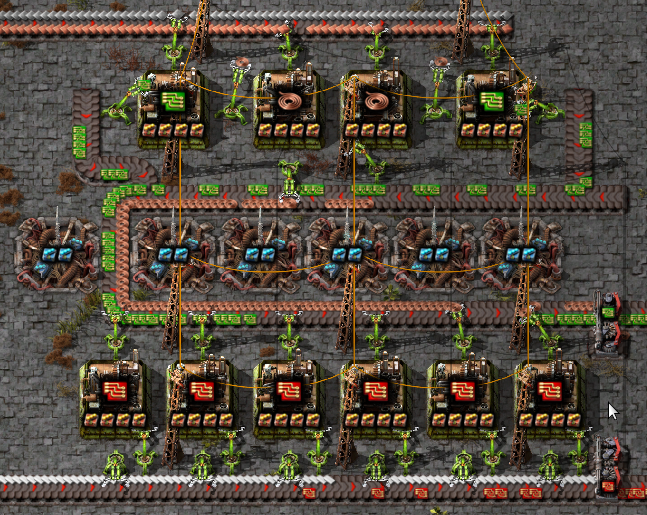

```{eval-rst}
.. highlight:: none
.. py:currentmodule:: factoriocalc
```

# Overview

This guide is meant to give you an overview of all the important parts of
FactorioCalc.  It does not spell out all the details for every function
introduced and assumes the examples provided are sufficient.  For complete
documentation see the [API docs](reference.rst).  A decent knowledge of how
to play Factorio is assumed.

+++ {"tags": ["_intro_p2"]}

This guide is also available as a <a href="guide-nb.ipynb">Jupyter notebook</a>
for use in Google Colaboratory or your own Jupyter instance.
A older version of this guide (0.2.0) is also available with JupyterLite
so that you can <a href="https://factoriocalc.readthedocs.io/en/v0.2.0/demo/lab/index.html?path=guide-0.2.0.ipynb">try the examples yourself</a>.

```{code-cell}
:tags: [remove-cell]

import os
import sys
sys.path.insert(0, os.path.abspath('../'))
```

## Basics

To use FactorioCalc you need to import it and call `setGameConfig` to set the
game configuration to match the version of Factorio you are using.  This
section of the guide will assume you are using Factorio 2.0 without the Space
Age addons.

All symbols you need are exported into the main `factoriocalc` namespace so it
is rare you will need to import from a sub-module.  FactorioCalc is meant to
be used interactively via a REPL, with details of your overall factory
collected in a simple script, or in a Jupyter notebook.
For this reason it is acceptable to use ``from
factoricalc import *`` and the rest of the documentation will assume you have
done so.

```{code-cell}
from factoriocalc import *
setGameConfig('v2.0');
```

For lack of a better term, *factory*, will be used throughout this document to
refer to any group of machines that work together to produce one or more
products.  The term *overall factory* will be used to refer to all the
factories on the map.

Factoricalc uses exact fractions internally.  For speed a custom fraction
class is used.  This class does not allow conversion from floats, as 0.12
as a float is not 12/100 but really 1080863910568919/9007199254740992, which
is almost certainly not what was intended.  There are various heuristics
that can be used to give a better conversion, but for now it is easier to
disallow them.  In almost any place that expects a number a string can be
used instead, in the rare case a number is needed the `frac()` function can be
used to create a `Frac`.  For example: ``frac('0.12')``, ``frac('1/3')``,
``frac(1,3)``.

Each machine is a class in the runtime generated `mch` package.  The name of
the machine is the same as the internal name but converted to TitleCase.  The
internal name is often the same as the English name, but not always.  To find a
machine based on the translated name you can use the `mch._find()` function.
To get the translated name of a machine use the `~Machine.descr` property.

To produce something from a machine you need to instantiate it.  The first
argument of the constructor is the recipe.  For example, to create an
"assembling-machine-3" that produces electronic circuits you could use
``mch.AssemblingMachine3(rcp.electronic_circuit)``.  Additional keyword
arguments can be provided to specify the fuel used, beacons, and modules, when
applicable.

Recipes are in the runtime generated `rcp` package and are the same as the
internal names but with ``-`` (dashes) converted to ``_`` (underscores).
Items are in `itm`.  Like the `mch` package, both the `rcp` and `itm` package
have have a `_find()` function to find an item based on the translated name.

Within FactorioCalc the items a machine produces or consumes is considered a
*flow*.  The rate of the flow is positive for items produced and negative
for items consumed.

To get the flow of items for a machine use the `~Machine.flows()` method,
for example:

```{code-cell}
mch.AssemblingMachine3(rcp.electronic_circuit).flows()
```

(Note that electricity used is also tracked as a flow.) To get a nicer
formatted version of the flows, use the `~Flows.print()` method:

```{code-cell}
mch.AssemblingMachine3(rcp.electronic_circuit).flows().print()
```

Multiple machines can be grouped together using the `+` operator which will
create a `Group`.  For example:

```{code-cell}
ec = mch.AssemblingMachine3(rcp.electronic_circuit) + mch.AssemblingMachine3(rcp.copper_cable)
ec
```

We can then get the flows of the group using the `~Group.flows()` method:

```{code-cell}
ec.flows().print()
```

This is showing us the maximum rates for the group, but there is a problem:
we are creating copper cables at a rate of 5/s but consuming them at -7.5/s.
The ``!`` after copper cables indicates a lack of an ingredient.  We can fix
this by using the correct ratios or by slowing down the machine that creates
electronic circuits by adjusting it's *throttle*.

To fix the ratios we can use the `*` operator to create multiple identical
machines.  For example:

```{code-cell}
ec2 = 2*mch.AssemblingMachine3(rcp.electronic_circuit) + 3*mch.AssemblingMachine3(rcp.copper_cable)
```

If we ask for the flows of the new `Group` we get:

```{code-cell}
ec2.flows().print()
```

To instead slow down the machines we need to adjust the *throttle*.  We can do
this manually, but it's best to let the solver determine it for us.  To do so,
we first need to wrap the group in a *box*:

```{code-cell}
b = Box(ec)
```
and then solve it:

```{code-cell}
b.solve()
```

The result of solve tells us a single unique solution was found.  If we
ask for the flows of the solved box we get:

```{code-cell}
b.flows().print()
```

Copper-cable is not in the list because it's net flow is now zero.  Boxes,
unlike groups, do not include internal flows unless the net flow is non-zero.
An *internal flow* is simply a flow in which there are both producers and
consumers within the same box.

As creating a box and then solving it is a very common operation the `box`
shortcut function is provided to do just that, it usage is the same as the
`Box` constructor.  For example, we could of instead used:

```{code-cell}
b = box(ec)
```

To determine what the solver did we can use the `~Box.summary()` method.
Calling it gives us:

```{code-cell}
b.summary()
```

The ``@0.66667`` indicates that the assembling machine for the
electronic-circuit is throttled and only running at 2/3 it's capacity.

(modules-and-beacons)=
## Modules And Beacons

Having to spell out the type of machine you want each time will get tedious
very fast so FactorioCalc provides a shortcut.  However, before we can use
the shortcut, we need to specify what type of assembling machine we want to
use.  This is done by setting `config.machinePrefs`, which is a python
`ContextVar`.  For now
we will set it to `~presets.MP_LATE_GAME` in the `presets` module which will use
the most advanced machines possible for a recipe:

```{code-cell}
from factoriocalc.presets import *
config.machinePrefs.set(MP_LATE_GAME);
```

With that we can simply call a recipe to produce a machine that will use the
given recipe.  Now to create electronic circuits from copper and iron plates
we can instead use:

```{code-cell}
ec2 = 2*rcp.electronic_circuit() + 3*rcp.copper_cable()
```

Of course in the late game we are going to want to use productivity-3
modules with beacons stuffed with speed-3 modules.  We can either pass modules and
beacons to the call above, or include them in the `~config.machinePrefs`.

To include them in the call simply use the *modules* and *beacons* parameter.
For example, to make electronic circuits with 4 productivity-3 modules and 8
beacons with speed-3 modules use:

```{code-cell}
rcp.electronic_circuit(modules=4*itm.productivity_module_3,
                       beacons=8*mch.Beacon(modules=2*itm.speed_module_3))
```

When specifying modules you can either provide a list of them (as above) or a
single module to fill the machine to with as many of that module as possible.
When you need a beacon with two speed-3 modules you can use the
`~presets.SPEED_BEACON` shortcut in `presets`.  For example, the above call
can become:

```{code-cell}
rcp.electronic_circuit(modules=itm.productivity_module_3,
                       beacons=8*SPEED_BEACON)
```

Specifying the modules and beacons configuration for each machine can be
tedious, so as an alternative FactorioCalc lets you set preferred machine
configurations as part of `config.machinePrefs`.  If all we cared about is
assembling machines we could just use:

```{code-cell}
config.machinePrefs.set([mch.AssemblingMachine3(modules=itm.productivity_module_3, 
                                                beacons=8*SPEED_BEACON)]);
```

However, we will most likely want all the machines to have the maximum number of
productivity-3 modules and at least some speed beacons.  To make this easier
the `~presets.MP_MAX_PROD` function can used to indicate that we want all machines to
have to maximum number of productivity-3 modules.  There is no preset for
beacons, as the number the beacons often varies.  Instead use the
`~presets.MP_MAX_PROD.withBeacons()` method to modify the preset by adding
`~presets.SPEED_BEACON`'s for specific machines.  For example:

```{code-cell}
config.machinePrefs.set(MP_MAX_PROD().withBeacons(SPEED_BEACON, {mch.AssemblingMachine3:8}));
```
will give all machines the maximum number of productivity-3 modules possible and
all assembling-machine-3s 8 `~presets.SPEED_BEACON`'s.  With `machinePrefs` set
we can than just use:

```{code-cell}
rcp.electronic_circuit()
```

Now lets try and combine electronic circuits with copper cables with maximum
productivity.  We could calculate the exact ratios or just guess and let
the solver do most of the math for use:

```{code-cell}
ec3 = box(rcp.electronic_circuit() + rcp.copper_cable())
ec3.summary(includeMachineFlows=True)
```

(The `includeMachineFlows` parameter will include the flows of individual
machine groups in the summary.  The ``~`` after an item in the flows indicates
the flow has been adjusted due to throttling.)

Looking at the above summary the electronic circuit are throttled at 93%, so
a 1:1 ratio is fairly close.  We could increase the number of machines, but
given the high flow of items, doing so will likely be difficult.  Maybe
we can decrease the number of beacons for the electronic circuits:

```{code-cell}
ec3 = box(rcp.electronic_circuit(beacons=6*SPEED_BEACON) + rcp.copper_cable())
ec3.summary()
```

That is only slightly better, but instead of not producing enough copper
cables we are producing more than enough, which is generally a better thing
to do.

(produce)=
## Using produce

(produce-usage)=
### Basic Usage

In the previous section we manually combined the machines.  It is also
possible to use the `produce` function to automatically determine the
required machines.  For example to produce electronic circuits at 30/s:

```{code-cell}
ec4 = produce([itm.electronic_circuit @ 30]).factory
ec4.summary()
```

The `@` operator pairs an item with a rate and returns a tuple.  The
``.factory`` at the end of produce is necessary because `produce` returns a
class with additional information about the solution it found, but for now we
only are interested in the result.

And, oops, we forgot to include speed beacons for electric furnaces in the
previous section.  I personally don't find it worth it to use modules for
basic smelting even in the late game so instead let's just change
`machinePrefs` to that effect:

```{code-cell}
config.machinePrefs.set([mch.ElectricFurnace(),
                        *MP_MAX_PROD().withBeacons(SPEED_BEACON, ({mch.AssemblingMachine3:8}))])
ec4 = produce([itm.electronic_circuit @ 30]).factory
ec4.summary()
```

Ok, we still need a lot of electronic furnaces, but I normally smelt in a
separate factory.  So let's instead create electronic circuits from just
iron and copper plates by using the `using` keyword argument:

```{code-cell}
ec5 = produce([itm.electronic_circuit @ 30], using = [itm.iron_plate, itm.copper_plate]).factory
ec5.summary()
```

The `using` keyword argument is a list that guides the machine selection
process: if the element is an item `produce` will attempt to use that item and
then stop once it does, if the element is a recipe than `produce` will
prefer that recipe over another when there are multiple possibles.

(constraints-first-used)=

Inputs can also be paired with a rate to use up to that amount of items.  When
rates are specified for the inputs, they can be left off of the outputs.  For
example, to determine the rate of electronic circuit we can create from a full
fast belt (30/s) of iron and copper plates:

```{code-cell}
ec6 = produce([itm.electronic_circuit], using = [itm.iron_plate @ 30, itm.copper_plate @ 30]).factory
ec6.summary()
```

Which tells use we can produce electronic-circuit at 39.2/s.

By default `produce` will create a box with fractional number of machines.  If
you prefer that it just rounds up, set the `roundUp` argument to `True`, for
example:

```{code-cell}
ec7 = produce([itm.electronic_circuit], using = [itm.iron_plate @ 30, itm.copper_plate @ 30], roundUp=True).factory
ec7.summary()
```

(oil-processing)=
### Oil Processing

FactorioCalc includes a simplex solver so it is able to handle complex cases,
such as producing items from crude oil using advanced oil processing or coal
liquefaction.  Since oil produced can be produced from either process you have
to specify which one to use with the `using` parameter.  For example, to make
plastic from crude oil:

```{code-cell}
config.machinePrefs.set(MP_MAX_PROD().withBeacons(SPEED_BEACON, 
                                                  ({mch.AssemblingMachine3:8, mch.ChemicalPlant:8, mch.OilRefinery:12})))
plastic1 = produce([itm.plastic_bar@90], using=[rcp.advanced_oil_processing]).factory
plastic1.summary()
```

And it will tell how many chemical plants you need for light and heavy oil
cracking.  If you rather use coal liquefaction:

```{code-cell}
plastic2 = produce([itm.plastic_bar@90], using=[rcp.coal_liquefaction], fuel=itm.solid_fuel).factory
plastic2.summary()
```

The `fuel` parameter specifies the fuel to use.  It defaults to the value of
`config.defaultFuel` which defaults to `itm.coal`.

It is just as easy to create rocket fuel:

```{code-cell}
rocketFuel = produce([itm.rocket_fuel@6], using=[rcp.advanced_oil_processing]).factory
rocketFuel.summary()
```

In this case there is no light oil cracking but some heavy oil cracking
as it more efficient to first convert heavy oil to light oil when creating
solid fuel.  The conversion of petroleum gas to light oil is unavoidable as
there is nothing else to do with the gas.

We can just as easily produce plastic and rocket fuel at the same time, which
will avoid the need to convert petroleum gas to solid fuel, but the entire
factory will grind to a halt if both products are not being created at the
same time.  FactorioCalc can fairly easy let you know what you need to produce
either plastic or rocket fuel, or both at the same time.  This will be covered
in a later section.

(boxes)=
## More on Boxes

(boxes-usage)=
### Basic Usage

A box is a wrapper around a group with additional constraints to limit flows.
So far we have been letting FactorioCalc determine the constraints
automatically.  For example, ``Box(rcp.electronic_circuit() +
rcp.copper_cable())``, will automatically set the external flow of copper
cables to zero as it is an internal flow.  Sometimes you may want to limit the
external flows or allow an internal flow to become external.  For this reason
the `Box` constructor, and corresponding `box` function, has a number of
arguments to let you fine tune the inputs and outputs.  For example,
to create both electric circuits and advanced circuits we need to explicitly
list the outputs so that the internal flow of electric circuits becomes
external:

```{code-cell}
config.machinePrefs.set(MP_MAX_PROD().withBeacons(SPEED_BEACON, 
                                                  ({mch.AssemblingMachine3:8, mch.ChemicalPlant:8, mch.OilRefinery:12})))
circuits1 = box(rcp.electronic_circuit() + 2*rcp.copper_cable() + 2*rcp.advanced_circuit(),
                outputs = [itm.electronic_circuit, itm.advanced_circuit])
circuits1.summary()
```

If there are not quite enough machines `box` can fail with `SolveRes.OK`.
This result means that a solution was found but it is not considered optimal.
A solution is generally considered optimal if all machines that produce an
output item are running at there maximum capacity.  If, in the previous
example we where to reduce numbers of copper cables machines to 1 either the
electronic circuits or the advanced circuit machines can run at full capacity
but not both.  To fix this we can use the `priorities` argument to specify
that a particular output should get priority over another.  For example:

```{code-cell}
circuits2 = box(rcp.electronic_circuit() + rcp.copper_cable() + 2*rcp.advanced_circuit(),
                outputs = [itm.electronic_circuit, itm.advanced_circuit],
        priorities = {itm.advanced_circuit:1})
circuits2.summary()
```

will give priory to the advanced circuits and output whatever it can of the
electronic circuits.  The values for the `priorities` argument mapping needs
to be between -100 and 100.  A priority can also be specified as part of the
outputs or inputs by using a string that starts with ``p`` or ``p:`` for
example:

```{code-cell}
circuits2 = box(rcp.electronic_circuit() + rcp.copper_cable() + 2*rcp.advanced_circuit(),
                outputs = [itm.electronic_circuit, itm.advanced_circuit @ 'p:1'])
```             

Another way to avoid `SolveRes.OK` is to specify rates for some of the
outputs, for example if we wanted electronic circuits at 8/s:

```{code-cell}
circuits3 = box(rcp.electronic_circuit() + rcp.copper_cable() + 2*rcp.advanced_circuit(),
                outputs = [itm.electronic_circuit @ 8, itm.advanced_circuit])
circuits3.summary()
```

Boxes can also have a set of constraints associated with it.  Constraints are
specified via the `constraints` parameters and is a mapping of items to
values.  When the value is a number than the rate for that item will be at
least that value: if it is positive than the box will produce at
least that amount, if it is negative the box will consume at most that
amount.  For example, to limit the number of iron plates in the previous example
to just 8/s:

```{code-cell}
circuits4 = box(rcp.electronic_circuit() + rcp.copper_cable() + 2*rcp.advanced_circuit(),
                outputs = [itm.electronic_circuit @ 8, itm.advanced_circuit],
                constraints = {itm.iron_plate: -8})
circuits4.summary()
```

By default input values of boxes are converted to constraints, so instead of
``constraints = {itm.iron_plate: -8}`` we could of just used ``inputs =
[itm.iron_plate @ 8]``.

Input constraints are most useful when the number of machines is not fixed, as
is the case with `produce`.  In fact, constraints were first used
[when setting the input rate](#constraints-first-used), in the section on
`produce`, but not explicitly mentioned.

(unbounded-throttles)=
### Unbounded Throttles

An unbounded throttle is a throttle that can be larger than 1.  It is useful
if you don't know the number of machines you need and want to let the solver
figure it out for you.  It is used internally by `produce`.

A throttle is marked as unbounded via the ``~`` operator; for example:
``~rcp.electronic_circuit()``.

If, for example, we wanted to produce electronic circuits at 28/s from copper
and iron plates we could use produce, but let's assume we would rather specify
the machines used.  We don't know the number of machines we need however, so
we use unbounded throttles to let the solver figure it out for use:

```{code-cell}
config.machinePrefs.set(MP_MAX_PROD().withBeacons(SPEED_BEACON, ({mch.AssemblingMachine3:8})))
circuits0 = box(~rcp.electronic_circuit() + ~rcp.copper_cable(),
                outputs={itm.electronic_circuit@28})
circuits0.summary()
```

The number in parentheses indicates that instead of 1.82 assembling machines
producing electronic circuits, there is a single machine with an unbounded
throttle of 1.82.

Unbounded throttles can be removed by using the `~Box.finalize()` method of a box.
For example:

```{code-cell}
circuits = circuits0.finalize().factory
circuits.summary()
```

The result of `~Box.finalize` is similar to `produce`.  As we are only interested
in the main results, we just extract the `factory` field.  Finalize, unlike
produce, rounds up by default, to avoid this use ``roundUp=False``.

### Using union

Getting back to our oil processing example from a [previous section](#oil-processing).
In that section we wanted to produce both plastic and rocket
fuel.  A naive solution is to just use ``produce([itm.plastic_bar@90,
itm.rocket_fuel@6], ...)`` but the resulting factory will only work if both
plastic bars and rocket fuel are being consumed.  If one of them is not being
consumed fast enough the oil refineries will eventually back up with excuses
petroleum gas or light oil.  We could simply combine the factory that produces
only plastic bar with one that only produces rocket fuel but this is
non-optimal as some of the petroleum gas will be used to create solid fuel and
some of the light oil needlessly being converted to petroleum gas.  Instead we
only want the petroleum gas to be converted to solid fuel and the light oil to
be converted to petroleum gas if there is an overflow.  To insure we have
enough machines to do so we need to take the union of three factories: one
that produces both optimally, one that produces just plastic, and one that
produces just rocket fuel.  We can do so with using the `union` function:

```{code-cell}
config.machinePrefs.set(MP_MAX_PROD().withBeacons(SPEED_BEACON, ({mch.AssemblingMachine3:8, mch.ChemicalPlant:8, mch.OilRefinery:12})))
both = produce([itm.plastic_bar@90, itm.rocket_fuel@6], using=[rcp.advanced_oil_processing]).factory
plastic = produce([itm.plastic_bar@90], using=[rcp.advanced_oil_processing]).factory
rocketFuel = produce([itm.rocket_fuel@6], using=[rcp.advanced_oil_processing]).factory
res = union(both, plastic, rocketFuel)
combined = res[0]
combined.solve()
combined.summary()
```

As you can see from the summary, when producing both items, the
light-oil-cracking chemical plant is not being fully utilized and the
solid-fuel-from-petroleum-gas chemical plant is not being used at all.
However, when just plastic or just rocket fuel are consumed they will be used.
To see how the machines are utilized when just one of the outputs are consumed
we can use the other values returned by `union`.

`union` returns a tuple with several factories.  The first one is the result.
The others are views of the first one.  If solve is called on a view it will
will change the first result to have the same flows as the solved view.
For example:

```{code-cell}
plastic = res[2]
plastic.solve()
combined.summary()
```

And as shown in the summary, when producing plastic the light-oil-cracking
chemical plants are fully utilized.

It should be noted that in order for this factory to work as intended the flow
of fluids into the light-oil-cracking and solid-fuel-from-petroleum-gas
chemical plants will need to be controlled via circuits.  We can get an idea
of what might happen if we don't use circuits by adjusting the priorities.
For example, to see what will happen if the petroleum gas is converted to
light oil we can up the priority for that chemical plant:

```{code-cell}
combined.priorities[rcp.solid_fuel_from_petroleum_gas] = 2
combined.solve()
```

And as a result the plastic output suffers as there is not enough petroleum
gas.  When solving we only got `SolveRes.OK`, which means that other solutions
are possible.  The slightly cryptic warning is telling us that the plastic
bars output could be higher in a different solution.  We can solidify this
result by adjusting the priority of `rcp.plastic_bar` to be larger than 0 but
smaller than the priority of `rcp.solid_fuel_from_petroleum_gas`:

```{code-cell}
combined.priorities[rcp.plastic_bar] = 1
combined.solve()
combined.summary()
```

And we increased the plastic output but rocket fuel output then suffers.

This experiment shows us that we need some circuits to prevent any conversion
of petroleum gas to solid fuel unless we have an overflow.

(nuclear-processing)=
### Nuclear Processing

Like oil processing, processing of uranium ore is tricky.  You will eventually
need to use the Kovarex enrichment process, but you can't overdue it,
otherwise you will have too much Uranium-235 and not enough Uranium-238.  In
addition you will also want to dispose of the used fuel cells by reprocessing
it back into a small amount of Uranium-238.  Fortunately FactorioCalc is up to
the task.  For example, here is a factory that provides the needs of nuclear
related produces for a fairly large overall factory:

```{code-cell}
nuclearStuff = withSettings(
  {config.machinePrefs: ((mch.Centrifuge(modules=2*itm.productivity_module_3,beacons=4*SPEED_BEACON),) + MP_LATE_GAME)},
  lambda: box(1*rcp.uranium_processing(beacons=5*SPEED_BEACON)
              + 3*rcp.uranium_processing(beacons=5*SPEED_BEACON)
              + 2*rcp.kovarex_enrichment_process(beacons=5*SPEED_BEACON)
              + 1*rcp.kovarex_enrichment_process(beacons=4*SPEED_BEACON)
              + 5*rcp.nuclear_fuel_reprocessing()
              + rcp.uranium_fuel_cell(modules=4*itm.productivity_module_3,beacons=1*SPEED_BEACON)
              + 3*rcp.nuclear_fuel()
              + 4*rcp.uranium_rounds_magazine(modules=[],beacons=[]),
              priorities={rcp.nuclear_fuel_reprocessing:2,itm.nuclear_fuel:1},
              constraints=[Equal(itm.uranium_fuel_cell, (-1, itm.depleted_uranium_fuel_cell))]))
```

In this factory, `withSettings` is a helper functional to set a context
variables to a different value locally.  An advanced feature of the
`constraints` parameter is also used so that the output of uranium fuel cells
matches the input of used up ones.

The exact amount of machines was determined mostly by trail and error.  Here
is a summary of the solved factory:

```{code-cell}
nuclearStuff.summary()
```

(blueprints-overview)=
## Working with Blueprints

FactorioCalc provides support for converting a blueprint of a factory into a
`Group` for further analysis with a few minor limitations.  For example,
furnaces in blueprint will be converted, but since they don't have a fixed
recipe, you will need to tell the convert function what recipe to use or
manually set the recipe afterwards.

(blueprints-example)=
### An Example

Here is a fairly simple blueprint to create electronic and advanced circuits
using productivity modules and beacons:



```{code-cell}
bp = '0eNq1W+1u4zgMfBf/dhaiPiy5r7IoFk7i7hqX2IbtFFcUffeT20OTTeWYnCL/mtYZUpRID4fqa7Y9nOp+aNope3jNml3XjtnDz9dsbH631WH+3fTS19lD1kz1McuztjrOn6pxrI/bQ9P+3hyr3Z+mrTcme8uzpt3X/2YP9JavQjxV47SZhqod+26YNtv6MF0g6LfHPKvbqZma+sOj9w8vv9rTcVsP0cRNoDzruzF+t2tn+xGv8D9cnr1kDxtDP1y0s2+GevfxgJ69vYLXQvhCBm+E8KUM3grhgwzefcKPU7X7Z9O0Yz1M8S9fkD19IquInMAqZK56JXPVC+FJBh8+4Y/1vjkdN/UhPj40u03fHeoEvv4rHvHbdfP7z7Y7DfMhpzI3/jFhphSuwshWQUqIr4X4xD8wbu3AkDA1LxB5zgpz01shvjA5vbBykRPiC0sXFfzNDKubKc1PYSGkIMQXVkIqhQUg0K0CEHKrU/mvhQkahGVMC9+mQViFtTBng7DAaMM+k0GvnUlt2WDn97IOLD8d+mL+im9T+MVthnbjffe/gQjfvJO1j3PctfEk75phd2pm92YGN85f7Yduf4qOPEfrm2P8+TDDR59STnl+wTDCeAbpet3Sendd39fDZldt39MWW2kpdSfc0x2j+FmhlgNfpKBJuNJz2t3voBnNX68VrldICoKTJa6xaEOgC1a/gRceHn4B43tWfLyUaNPVAq7fsyr3NvWqNQFtSL5GKrmSEuDC79CpPk9Jw+JvhSVG2eo8mFRcLAG0b9FvLaVN5pbfMQyRiJVJ6mTxzGXtp7UwPuvk23PmbutqFx+7oW1o8w75WT3Hvq73F2VTJzejgGuPY63Aw/iWhY9nrOPUfluiGgIP36nVHb6ARHbYEdrfM1egUX2CiW/WI2S/FyGLNv3MFThUtGDiF2jTz8T3qGjBxA/rO/y9KudKVAngraBQqJLBxKfVCF2QeCRChUZFAOYKDCpiMPGlb2JhFSocKmIw8Yv1HTbf22FhFgdhlSsCzIV4+MIcDsIq5xXMVDSHqXiC8Q0LXyPK1YIM5uEZleZNZize0qlk7xJMTio5P/EOpnC8tcBTLCa+QELTqxsbYLbGc7aE2SZv5qaQDnohGIFgYsZzVsPEkodvcAUgkUUxKWMzXeqcKNlNB3h4xVwOPLxi4iPDq8WzAw+vmM7CwysmPl+KCrQWjBIeUfGcLeERFRP/G5JUapJnZimNKD3ONzBT5a3FwkyVh+9gnsfDLxAhf+lg4qSX5+xVlo79oZnSvl4UqyvcPHtqDvOXFuYh3WnqT9Ovfmi6IRqPjx3qp/m+1Fd3pBxZWKFJKeHo50wM6Wr0U+2fq3YX+5ZvDn5IScdRZ85xP580PJu8n08GHlDezycrHSXS/X1yUp/s/X0qgOaOWDOM2DXBvRgVSRa5wB9JBT4BU3/ZSKKVwNWCRTRSQJfFjDB0BY6LreEeILV782mYW+k0dyHi37U5s/PlmFuAkHPjIrinWq57WgBsmeuph8lncgfjiUhPQ4kCcFNqOSaCDsKtomkF0D5mhK9vuHFYGhXLLC1R1r9ytCHuSZKkkfRC3HnES47F0rRBL7BzDcA3VrgG4CsrXAOwaMc1AF8+5xqAlTyuAVjKYxowCpXfuAYI1d+4BjSqiHENGFQS4xqwqIzFNeBQHYtroEC1J64Bj4pPXAMBVYS4BkpUEmIasArVhLgGCNVxuAY0qpykDDx+9HnzMPfzP+zy7Lkexo8HAllfau+NL12IHd9/xQERxQ=='
```

To import it and convert it:

```{code-cell}
circuits = importBlueprint(bp).convert()
```

`importBlueprint` returns a `Blueprint` object.  The `~Blueprint.convert()`
method converts the blueprint into a nested group.  The outer group contains
two inner groups. The first inner group is the factory, and the second is the
beacons the factory used.

We are generally only interested in the first inner group (the one with the
factory).  We can view it using the `Group.pprint()` methods, which is just a
nicer formatted version of `repr`:

```{code-cell}
circuits[0].pprint()
```

As shown above, the output of `~Blueprint.convert()` contains each machine
individually converted, and the blueprint info is stored along with the object.
In most cases this is more information than we need.  We can clean this up by
calling `Group.simplify()` and then `Group.sorted()`:

```{code-cell}
circuits = circuits[0].simplify().sorted()
circuits.pprint()
```

As a shortcut, instead of calling `~Blueprint.convert()` then
`~Group.simplify()` and finally `~Group.sorted()` we can instead just use the
`~Blueprint.group()` method:

```{code-cell}
circuits = importBlueprint(bp).group()
```

If we look at flows of the factory, we will notice that there is not quite
enough copper cables, so the rates of the electronic circuits will be slightly too high:

```{code-cell}
circuits.flows().print()
```
To fix this, we need to wrap the factory in a box, and give the advanced circuit priority:

```{code-cell}
circuits = box(circuits, outputs = [itm.electronic_circuit, itm.advanced_circuit@'p1'])
circuits.summary()
```

Being able to wrap the converted blueprint in a box to limit flows is the
primary advantage of using of using FactorioCalc to analysis flows of a
factory over in game tools such as "Rate Calculator" and "Max Rate
Calculator".

See the [Blueprints](reference.rst#blueprints) section in the reference manual for more advanced
usages.

## Space Age

Factorio has support for most aspects of the Spage Age addon, including full
support to quality.  To use it simply set the game config `'v2.0-sa'` instead
of `'v2.0'`:

To plan your factorio for Space Agse you need to simply set the game config to
`'v2.0-sa'` instead of `'v2.0'` for example:

```{code-cell}
setGameConfig('v2.0-sa');
```

Note that calling this function creates a completly new set of symbols.
Mixing reference to symbols created before and after this call will likely
create unexpected results.

Examples for the rest of this guide will assume that the game config is set to
`'v2.0-sa'`.

### Recipe Productivity

Recipe productivity bonuses are fully supported.  You can change the
productivity bonus for a particular recipe by modifying
`config.Gameinfo.recipeProductivityBonus` in the `config.gameInfo` object.
Note that `config.gameInfo` is a `ContextVar` so you need to call
`ContextVar.get()` to retrieve it first.  For example to set the productivity
bonus for processing units:

```python
 config.gameInfo.get().recipeProductivityBonus[rcp.processing_unit] = frac('0.5')
```

Recipe productivity bonuses can also be imported from your current game, see
[Custom Game Configurations](#custom-game-config).

### Presets

FactorioCalc provides a different set of presets for Space Age.

`MP_EARLY_GAME` is similar to the same preset in the base game.
`MP_EARLY_MID_GAME` is similar to the `MP_LATE_GAME` preset for the base game.
`MP_LATE_GAME` will use the best machines available, except that
`rcp.rocket_fuel`, `rcp.light_oil_cracking` and `rcp.heavy_oil_cracking` will
still use a chemical plant instead of a biochamber.  `MP_LEGENDARY` will use
legendary machines with legendary productivity 3 modules when applicable, and
legendary quality 3 moduless for the recycler except for scrap recycling which
doesn't use any modules by default.

The `sciencePacks` presets is also provided and includes all the late game
sciences, including the Promethium Science Pack.

## Quality

FactorioCalc has full support for quality.  For simplicity higher quality
versions of items and recipes are distinct objects with the name of the
quality as the prefix.  For example the higher quality versions of
`itm.electronic_circuit` are: `itm.uncommon_electronic_circuit`,
`itm.rare_electronic_circuit`, `itm.epic_electronic_circuit` and
`itm.legendary_electronic_circuit`.

Quality modules are fully supported and will change the recipe to output
higher quality items in the correct ratios.  The maximum quality outputted can
be controlled via `config.GameInfo.maxQualityIdx`, which is a number between 0
and 4, for example: 0 for no quality, 2 for uncommon and rare, and 4 for all quality
levels.  It defaults to 4.

To aid in creating quality builds the shortcut property `.allQualities<>` can
be used to return that item or recipe in all qualties (up to
`config.GameInfo.maxQualityIdx`) as a sequence.  When used on a recipe the
sequence also supports being called to create a machine for each recipe; for example,
``rcp.legendary_electronic_circuit.allQualities()``.

The propery `.normalQuality<>` can be used as a shortcut for
`.allQualities[0]<>`.  In addition `.quality<>` will return the name of the
quality for the current item or recipe and `.qualityIdx<>` will return the
index.

### Examples

As an example of using quality let's try two methods of late game quality
grinding for legendary electronic circuits.

The first method will use legendary quality 3 modules for the electronic
circuits:

```{code-cell}
config.machinePrefs.set(presets.MP_LEGENDARY)
withQuality = box([*~rcp.electronic_circuit.allQualities[0:4](modules=itm.legendary_quality_module_3),
                   ~rcp.legendary_electronic_circuit(),
                   *~rcp.electronic_circuit_recycling.allQualities[0:4]()],
                  inputs = rcp.electronic_circuit.inputs,
                  outputs = [itm.legendary_electronic_circuit@1])
withQuality.summary()
```

(Note that the MP_LEGENDARY preset will use legendary quality 3 modules for all
recycling recipes, and legendary productivity 3 modules when possible.)

And the second method will instead use legendary productivity 3 modules for
the electronic circuits:


```{code-cell}
withProd =  box([*~rcp.electronic_circuit.allQualities(beacons = 1*mch.LegendaryBeacon(itm.legendary_speed_module_3)),
                 *~rcp.electronic_circuit_recycling.allQualities[0:4]()],
                inputs = rcp.electronic_circuit.inputs,
                outputs = [itm.legendary_electronic_circuit@1])
withProd.summary()
```

Surprisingly, even at just 175% productivity it is better to use productivity
instead of quality modules for the electronic circuits.  This also requires
fewer machines as we can use speed beacons.

It is also possible to try both methods at once at let the solver figure out
the optimal combination:

```{code-cell}
withProd =  box([*~rcp.electronic_circuit.allQualities[0:4](modules=itm.legendary_quality_module_3),
                 *~rcp.electronic_circuit.allQualities(beacons = 1*mch.LegendaryBeacon(itm.legendary_speed_module_3)),
                 *~rcp.electronic_circuit_recycling.allQualities[0:4]()],
                inputs = rcp.electronic_circuit.inputs,
                outputs = [itm.legendary_electronic_circuit@1])
withProd.summary()
```

(custom-game-config)=
## Custom Game Configurations

As previous shown, `setGameConfig` can be used to set or change the game
configuration.  It can also be used to to load a custom game configuration
from a JSON file.  Any call to `setGameConfig` replaces all the symbols in the
`itm`, `rcp`, `mch`, and `presets` packages so any non symbolic references to
the old symbols are unlikely to work correctly with the new configuration.

(builtin-game-modes)=
### Builtin Game Modes

FactorioCalc supprts the following game modes: ``v1.1``, ``v1.1-expensive``,
``v2.0``, ``v2.0-sa``.

To change the game mode simply call setGameConfig with one of those modes as
the first argument, for example for version 1.1 of Factorio:

```python
setGameConfig('v1.1')
```

(alternative-configs)=
### Alternative Configurations and Locale Support

FactorioCalc also supports loading a custom game configuration from a JSON
file.  This is useful as it can include state information from the current
game such as if a recipe is enabled and recipe productivity bonus.  It is also
the only way to get non-English translations for the `.descr<>` property and
`._find()<>` function.

To load a custom configuration, you first need to export the data from Factorio
in the configuration you want.  To export the data use the
[Recipe Exporter](https://mods.factorio.com/mod/RecipeExporter)
mod.  Install it, and load a map with the configuration you want.  Then,
from the console run the ``dump_recipes`` command.  This command will export
the recipes and other needed data to the ``script-output/recipes.json``
file.  Then, to load the file for the base game use:

```python
setGameConfig('custom', userRecipesFile())
```

`userRecipesFile()` assumes Factorio is storing its data in the standard
location (``%APPDATA%\Factorio`` for Windows or ``$HOME/.factorio`` for
Linux).  If this is not the case you will need to provide the correct path.

To load a configuration for Space Age instead, change ``'custom'`` to ``'custom-sa'``.

To skip recipes that have not been researched yet, pass ``includeDisabled =
False`` into the call to `setGameConfig`.

When loading a custom configuration recipe productivity bonus are included by
default, to not import them pass ``importBonuses = False`` into the call to
`setGameConfig`.

(mod-support)=
### Mod Support

For a simple mod that only adds recipes or makes very simple changes, you can
load the configuration like you would in the previous section by calling
`setGameConfig` with ``'custom'`` or ``'custom-sa'`` as the first parameter.

Overhaul mods will take a little more work.  For basic support you can just
call `setGameConfig` with the ``'mod'`` as the first parameter.  Unlike ``'custom'``
this assumes nothing about the games configuration: the `presets` package will
be empty, `produce` is unlikely to work for recipes with multiple outputs, and
although it will be able to derive recipes for rocket launch products the
names will be mangled.

Currently FactorioCalc has builtin support for "Space Exploitation",
"Krastorio 2" and "SEK2" (Space Exploration + Krastorio 2).  A recipe file is
not provided, however, as any provided is likely to out of date and will not
match your exact configuration.  To enable support use the name as first
parameter to `setGameConfig`.  For additional information see the
documentation for the [`mods` module](reference.rst#module-factoriocalc.mods).

(adding-mods)=
### Adding Additional Mods

To add support for additional mods it is best to look at the source code, in
particular the files ``factoriocalc/import_.py`` and ``factoriocalc/mod.py``.

(advanced-usage)=
## Advanced Usage

(unconstrained-flows)=
### Unconstrained Flows

In Space Exploration many recipes create byproducts, and other recipes may
consume that byproduct, but not as the only ingredient.  If both recipes are
used in the same factory the net output of the byproduct may be positive or
negative.  To handle this the byproduct needs to be marked as *unconstrained*.
The *unconstrained* parameter of the Box constructor is a simple list of flows
you want to mark as unconstrained.

Failure to mark a flow as unconstrained may result in a solution that sets
all the machines throttles to zero (or in the lesser case just throttles
machines unexpectedly).  If this happens the `~Box.unconstrainedHints`
property may give you hints about what values might need to be marked as
unconstrained, but, as of now, it is not comprehensive.  If the hints in
`~Box.unconstrainedHints` fail, then the best thing to do is reset the
throttles back to 1 using `~Box.resetThrottle()` and use
`~Box.internalFlows()` to list the internal flows.  Then, carefully evaluate
the internal flows to determine if any of them need to marked as
unconstrained.

(advanced-beacon-usage)=
### Advanced Beacon Usage

In Krastorio 2 you often only need one machine in the late game due to the
high speed of the advanced machines and the number of singularity beacons you
can surround it by.  FactorioCalc provides several tools to help with the
calculation of the number of beacons needed.

The first tool is the use of a counter beacon to bring the speed of the machine,
with productivity modules, back to one.  This will make it easier to determine
the number of speed beacons required based on the number of machines reported.
To use a counter beacon simply specify the string ``counter`` where ever a
beacon is expected.  The special string will create a `FakeBeacon` to counter
any negative effects of the modules and bring everything back to one.  The
easiest way to use a counter beacon is to specify the string as part of call
to `presets.MP_MAX_PROD` when setting `config.machinePrefs`, for example:
``config.machinePrefs.set(presets.MP_MAX_PROD(beacon='counter'))``

The second tool is the `useSpeedBeacons` function to let FactorioCalc do the
calculation for you.  The `useSpeedBeacons` function will add enough speed
beacons to reduce the number of machines needed to one.
